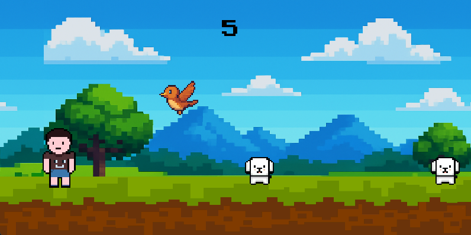

  

# Retro Runner
Retro Runner is my first project built with Python and Pygame, created as I began learning game development. It’s a pixel-style endless runner where the player must jump and dodge obstacles while the ground scrolls endlessly. The game features simple retro visuals, smooth movement, collision detection, and a scoring system that tracks how long you survive.

## Features
- **Endless Runner Gameplay** - survive as long as possible by dodging incoming obstacles.
- **Score System** - tracks how long you last in real time.
- **Simple Controls** - jump using the spacebar or mouse click.
- **Lightweight** - built entirely with Python and Pygame, easy to run on most systems.

## Preview

    
    

